# SunSystems automated backups script

This repository hosts the powershell script and provides change control.

## Table Of Contents

<!-- MarkdownTOC depth=3 autolink=true bracket=round -->

- [Getting Started:](#getting-started)
    - [Install 7z](#install-7z)
    - [Add PowerShell-ISE to server (Optional)](#add-powershell-ise-to-server-optional)
    - [Ensure `ExecutionPolicy` allows unsigned local scripts](#ensure-executionpolicy-allows-unsigned-local-scripts)
    - [Create a Windows account as a backup operator for the Auto backup script.](#create-a-windows-account-as-a-backup-operator-for-the-auto-backup-script)
    - [Create a SunSystems account for backup operator](#create-a-sunsystems-account-for-backup-operator)
    - [Record a SunSystems macro called `FB`](#record-a-sunsystems-macro-called-fb)
    - [Edit the SunSystems Macro (add username & password)](#edit-the-sunsystems-macro-add-username--password)
    - [Get the latest backup-script files](#get-the-latest-backup-script-files)
    - [Edit the `config.xml`](#edit-the-configxml)
    - [Test the `SunBackup.ps1` script](#test-the-sunbackupps1-script)
    - [Schedule the `SunBackup.ps1` script](#schedule-the-sunbackupps1-script)
- [Script Feature Overview:](#script-feature-overview)
- [ChangeLog](#changelog)
- [PowerShell basics](#powershell-basics)

<!-- /MarkdownTOC -->

## Getting Started:

### Install 7z

Ensure 7zip is installed on the server, without 7z the script will fail.

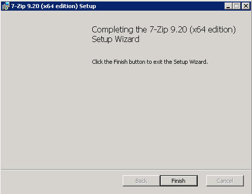

### Add PowerShell-ISE to server (Optional)

this is not mandatory, but is very useful when you are required to review or edit the script.

Through Windows Server Feature Manager

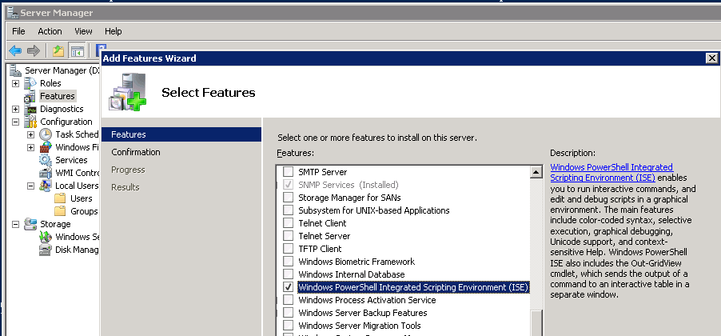

or using PowerShell to enable ISE directly

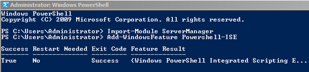

### Ensure `ExecutionPolicy` allows unsigned local scripts


**Note**: `RemoteSigned` will allow local scripts to be unsigned, but require remote scripts to be signed. Before changing the execution policy - ensure it was not set to `Unrestricted` by someone else. Below screenshot shows the `ExecutionPolicy` was set to `Unrestricted` in which case we should **not** modify the setting.

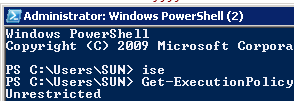

To set the `ExectionPolicy` run the `Set-ExecutionPolicy` cmdlet with `RemoteSigned` as the new value:

```
#!powershell
Set-ExecutionPolicy RemoteSigned
```

### Create a Windows account as a backup operator for the Auto backup script. 

Only provide the minimum permissions required for the script:

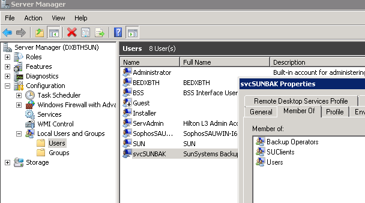

1. This account should be able to run SunSystems (should be member of SUClients local group)
2. This account should be able to run scripts on schedule (should be a member of Backup Operators local group)
3. This account password should **not expire** and **be strong**

### Create a SunSystems account for backup operator

Enable windows authentication and give ISM permissions to the backup operator account:

1. General, added to ISM group

    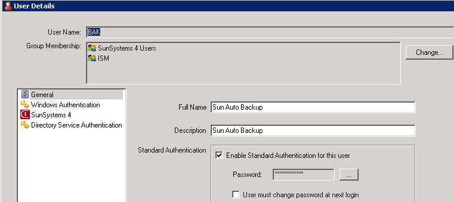

2. SunSystems 4 settings

    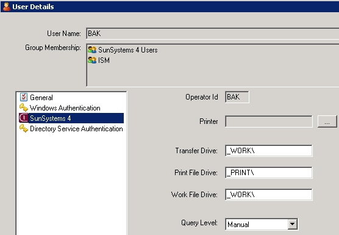

3. Windows Authentication

    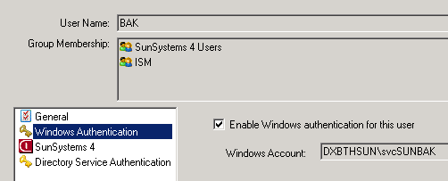

### Record a SunSystems macro called `FB`
Ensure the macro covers all the databases requiring daily backups. This macro will be stored in the `STANDARD.MDF` file in SunSystems root folder.

**Note**: `SunBackup.ps1` expects the macro name to be `FB` and it should be located in the `STANDARD.MDF` file.

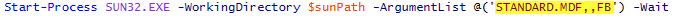

### Edit the SunSystems Macro (add username & password)

Once the macro has been recorded, it is required to **edit** the macro, adding the Backup user SUN Operator ID and Password, below the macro name but before any SunSystems commands. This is required to run scripts from command line even with Windows Authentication enabled on the account. 

**Note**: Due to the Hilton Policy, after 90 days the password will be expired and will need to be updated. The script will notify relevant parties when the backups are no longer working.

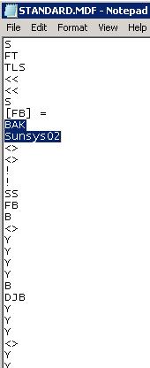

### Get the latest backup-script files

You can get the latest version of the script via https://github.com/trgint/trg.hhc.autobackup

or with this one liner **powershell 3+** (Windows Server 2012):

    @("config.xml","SunBackup.ps1","ScheduleBackup.ps1") | % { iwr ("https://github.com/trgint/trg.hhc.autobackup/raw/master/$_") -OutFile $_ }

or with this one liner for **powershell 2** (Windows Server 2008):

    @("SunBackup.ps1","config.xml","ScheduleBackup.ps1") | % { (New-Object System.IO.StreamReader((New-Object System.Net.WebClient).OpenRead("https://github.com/trgint/trg.hhc.autobackup/raw/master/{0}" -f $_ ))).ReadToEnd() | Out-File $_ }

### Edit the `config.xml`

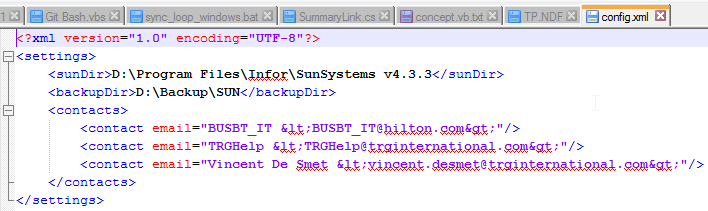

Ensure the following 2 points:

1. The config should point to the correct FileSystems paths, **communicate these paths to ISM** to ensure tape backups or network mirrored folders exist

2. Update the e-mail contacts to be notified in case SunSystems backup files are out of date.

    **Note** `<` and `>` are invalid characters in XML and need to be written as `&lt;` and `&gt;` to ensure email contacts show up with a caption `TRGHelp <trghelp@trginternational.com>` becomes `TRGHelp &lt;TRGHelp@trginternational.com&gt;`

    **Note** some ISM create an `<INNCODE>_IT@Hilton.com` alias for their property to ensure future emails will always reach the correct person (in case ISM moved to another property of left the company), **please verify with ISM if such alias exists**

### Test the `SunBackup.ps1` script 

Test the script by running it with PowerShell. For example using the standard windows command shell:

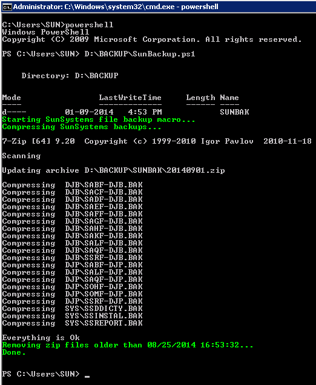

### Schedule the `SunBackup.ps1` script

A Scheduled task should be created to run the `SunBackup.ps1` script daily outside of working hours.

Either schedule the task manually, following the screenshots below, or download & run the `ScheduleBackup.ps1` script.

```
#!powershell
.\ScheduleBackup.ps1
```

This will download a Task configuration template and prompt for the Windows account `.\svcSunBaK` created [earlier](# markdown-header-create-a-sunsystems-account-for-backup-operator).

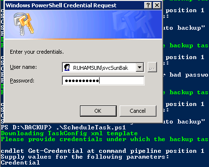

Ensure the following 4 points:

1. Run the task using the Windows account `.\svcSunBaK` created [earlier](# markdown-header-create-a-sunsystems-account-for-backup-operator). Configure the task to **run wether user is logged on or not**

    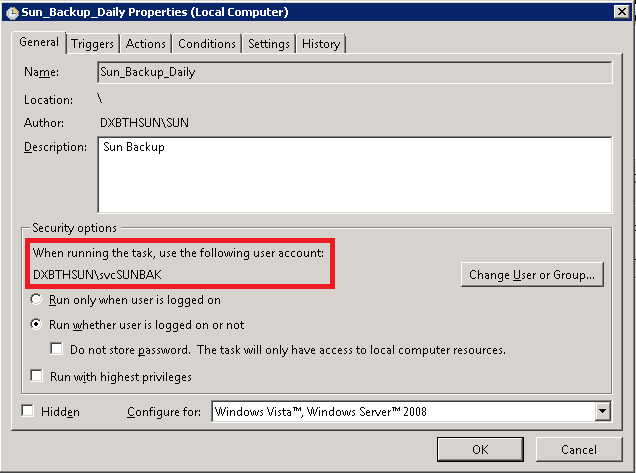

2. Schedule the task to run daily at a time sun operators would not be logged in making sure operation is not affected by the strain of the File Backup function.

    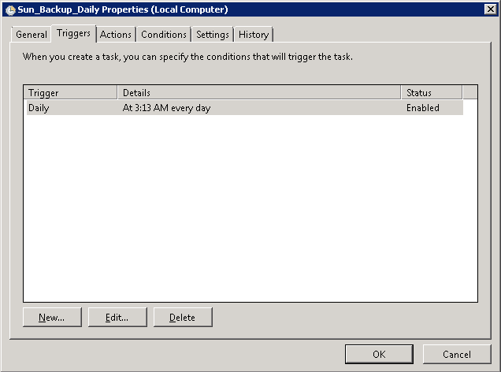

3. Create the action to run the PowerShell script under the Actions tab: 

    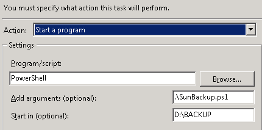

4. \[Optional\] create more actions, although scheduling this task to send an email daily will result in these emails being ignored and nobody will notice the task is not running anymore and that would defeat the purpose of the email...

    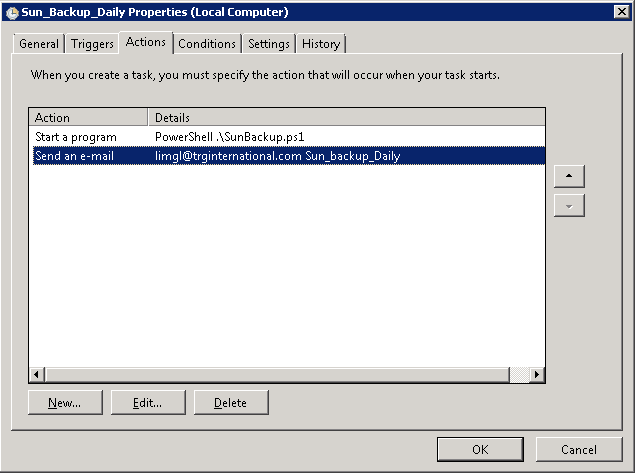

Finally, test the task by triggering the task manually:

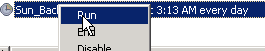

Review the History to ensure the Task ran successfully

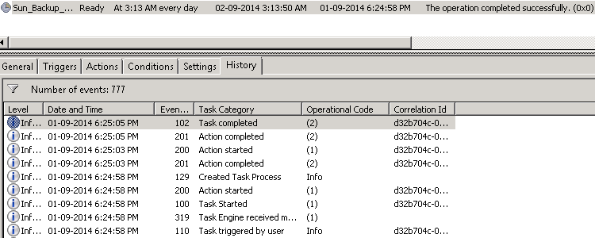

## Script Feature Overview:

This PowerShell script has the following features:

- Only requires `PowerShell`, `7zip` and a Sun `FB` macro in the **Standard** Macro Definition file. This script does not rely on any other programs or batch files and stands by itself. 
`PowerShell` comes by default on recent versions of Microsoft Operating Systems (Windows 7+ & Windows Server 2008+)
- Ability to **detect the age of SunSystems backup files**, ensuring the files being archived are up to date.
- Ability to **send a high priority email with detailed instructions** in case the SunSystems backup files are outdated. (**and only IF the files are outdated**, saving the e-mail inbox of everybody involved)
- Ability to effectively name the archives being created with a full ISO date not relying on registry keys to parse file system dates (as the old MSDOS batch had to do)
- Ability to prevent a full disk by removing any backups older than 4 weeks

## ChangeLog

Date          | By               | Changes
------------- | ---------------- | ---------------------------------------------------------------
April 2015    | Vincent De Smet  | added script to source control https://bitbucket.org/trginternational/trg.hhc.autobackup/
              |                  | converted documentation from word to markdown
              |                  | added ability to kill sun32.exe based on time-out - ensuring email is sent
              |                  | added ability to lookup airport information based on INNCODE
              |                  | added task scheduler, migrated to github https://github.com/trgint/trg.hhc.autobackup
November 2014 | Vincent De Smet  | Fixed bug causing script not to remove older backups correctly
August 2014   | Vincent De Smet  | This is the 2nd version of the PowerShell script adding the ability to identify backup file age, emails and removing the reliance on additional files
August 2013   | Vincent De Smet  | This is the 1st version of the PowerShell script using the PowerShell advanced DateTime and filtering capabilities to easily name archive files and delete archives older than a 7 days. Created by Vincent De Smet

## PowerShell basics

This PowerShell script relies on the following PowerShell basics:

- The array operator [`@( .. )`](http://technet.microsoft.com/en-us/library/hh847882.aspx) to create arrays
- The hashtable operator [` @{ <name> = <value>; [<name> = <value> ] ...}`](https://technet.microsoft.com/en-us/library/hh847780.aspx)
- [`Join-Path`](http://technet.microsoft.com/en-us/library/hh849799.aspx) cmdlet is used to compose system independent paths
- The [`Get-Date`](http://technet.microsoft.com/en-us/library/hh849887.aspx) cmdlet to get a DateTime object
- The [`DateTime`](http://msdn.microsoft.com/en-us/library/system.datetime_members.aspx) object member functions such as .AddDays()
- The Here-String [`@” .. “@`](http://technet.microsoft.com/en-us/library/ee692792.aspx) to conveniently compose the e-mail body with placeholders
- The [`format (-f)`](http://social.technet.microsoft.com/wiki/contents/articles/7855.using-the-f-format-operator-in-powershell.aspx) operator to set the “from” field of the email to the server name and fill out the placeholders in the e-mail body.
- The [`New-Item`](http://technet.microsoft.com/en-us/library/ee176914.aspx) cmdlet to ensure the target backup path exists (with the -Force argument switch)
- The [`Measure-Object`](http://technet.microsoft.com/en-us/library/hh849965.aspx) cmdlet and [`Measure-Latest`](http://dmitrysotnikov.wordpress.com/2008/07/16/measure-latest-finding-the-latest-date-time/) function to get the latest LastWriteTime of the backup files
- The [`Start-Process`](http://technet.microsoft.com/en-us/library/hh849848.aspx) cmdlet to start a process with a certain working directory and argumentlist
- The [`Get-ChildItem`](http://technet.microsoft.com/en-us/library/ee176841.aspx) cmdlet to recursively fetch files and subdirectories filtering on extension
- The [`Call (&)`](http://technet.microsoft.com/en-us/library/hh847732.aspx) operator to call 7zip with all required arguments
- The [`Send-Mailmessage`](http://technet.microsoft.com/en-us/library/hh849925.aspx) cmdlet to intuitively send an email from the script

Additional Tips to better understand the inner workings of this script:

- Read about [Scripting in PowerShell](http://technet.microsoft.com/en-us/library/bb978526.aspx)
- Use the [`Get-Member`](http://technet.microsoft.com/en-us/library/ee176854.aspx) & [`Get-Help`](http://technet.microsoft.com/en-us/library/ee176848.aspx) cmdlets to get information on the member functions available in PowerShell objects
- Read about the [Automatic variables](http://technet.microsoft.com/en-us/library/dd347675.aspx) maintained by the PowerShell runtime
- Read about the [fundamental concept of drives](http://blogs.technet.com/b/heyscriptingguy/archive/2011/09/07/use-powershell-to-work-easily-with-drives-and-paths.aspx) in Powershell 
- Read about the [environment provider](http://technet.microsoft.com/en-us/library/hh847860.aspx) 
- This PowerShell script does not use aliases for the cmdlets to ensure maximum readability except for:

    - `?` as an alias for the [`Where-Object`](http://technet.microsoft.com/en-us/library/hh849715.aspx) cmdlet
    - `%` as an alias for the `ForEach-object` cmdlet

- [This technet blog](http://blogs.technet.com/b/heyscriptingguy/archive/2013/07/04/use-powershell-to-translate-airport-code-to-city-name.aspx) walks you through using a webservice.


